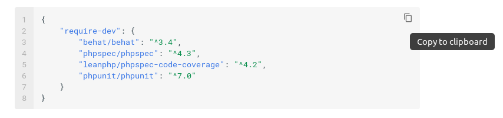

# Crear el proyecto

Vamos a implementar el proyecto que implemente las características descritas en el apartado anterior. Vamos a hacer uso de un esqueleto que ya tiene configurado:

    #!console
    composer create aulasoftwarelibre/bdd-by-example

Se nos creará un directorio con todo lo que necesitamos para empezar a trabajar. Si analizamos el fichero `composer.json` veremos las dependencias de nuestro proyecto:

    #!json
    {
        "require-dev": {
            "behat/behat": "^3.4",
            "phpspec/phpspec": "^4.3",
            "leanphp/phpspec-code-coverage": "^4.2",
            "phpunit/phpunit": "^7.0"
        }
    }

## Creación de características

Las características (ficheros `.feature`) deben ir dentro del directorio `features/` de nuestro proyecto.

!!! tip

    Las cajas de ejemplo tienen un icono que, si lo pulsas, permiten copiar el contenido al portapapeles. Úsalo para ir más rápido al copiar el código.

    

Crearemos dentro de dicho directorio un fichero llamado `menu.feature` con el contenido que describimos en el capítulo anterior.

    #!gherkin
    #language: es
    Característica: Pagar un menú
        Reglas:

        - 1 punto por cada euro.
        - 10 puntos equivalen a un descuento de 1 euros.
        - El IVA es del 10%

        Antecedentes:
            Dados los siguientes menús:
            | número | precio |
            | 1      | 10     |
            | 2      | 12     |
            | 3      |  8     |

        Escenario: Ganar puntos al pagar en efectivo
            Dado que he comprado 5 menús del número 1
            Cuando pido la cuenta recibo una factura de 55 euros
            Y pago en efectivo con 55 euros
            Entonces la factura está pagada
            Y he obtenido 50 puntos

        Escenario: Pagar con dinero y puntos
            Dado que he comprado 5 menús del número 1
            Cuando pido la cuenta recibo una factura de 55 euros
            Y pago con 10 puntos y 54 euros
            Entonces la factura está pagada
            Y he obtenido 0 puntos

        Escenario: Pagar con puntos
            Dado que he comprado 5 menús del número 1
            Cuando pido la cuenta recibo una factura de 55 euros
            Y pago con 500 puntos y 5 euros
            Entonces la factura está pagada
            Y he obtenido 0 puntos

        Escenario: Intentar pagar el IVA con puntos
            Dado que he comprado 5 menús del número 1
            Cuando pido la cuenta recibo una factura de 55 euros
            Y pago con 550 puntos y 0 euros
            Entonces la factura no está pagada
            Y quedan 5 euros por pagar

        Escenario: Comprar menús de varios tipos
            Dado que he comprado 1 menú del número 1
            Y que he comprado 2 menús del número 2
            Y que he comprado 2 menús del número 3
            Cuando pido la cuenta recibo una factura de 55 euros
            Y pago en efectivo con 55 euros
            Entonces la factura está pagada
            Y he obtenido 50 puntos

## Ejecución de behat

Ahora que tenemos las pruebas definidas vamos a ejecutar _behat_:

    #!sh
    vendor/bin/behat --snippets-for FeatureContext

Obtendremos el resumen de la ejecución de pruebas que contiene la siguiente información:

    #!sh
    5 scenarios (5 undefined)
    32 steps (32 undefined)
    0m0.02s (9.49Mb)

Lo que significa es que _behat_ no reconoce ninguno de los _step_ o pasos de los que se compone cada escenario. Esa parte debemos programarla nosotros. Para ello _behat_ nos facilita el trabajo con una serie de _snippets_. Veamos uno:

    #!php
    <?php
    /**
     * @Given que he comprado :arg1 menús del número :arg2
     */
    public function queHeCompradoMenusDelNumero($arg1, $arg2)
    {
        throw new PendingException();
    }

El _step_ se compone de una cabecera con las palabras `@Given`, `@When` o `@Then`  y una frase que coincide con la que hayamos determinado en el paso. Los números y las cadenas que se pongan entre comillas se convierten en parámetros del paso. También es posible usar expresiones regulares, pero en esos casos debemos hacerlo a mano. El objetivo es meter todos estos snippets en el archivo de contexto que usa _Behat_.

Si editamos el archivo _features/bootstrap/FeatureContext.php_, veremos el archivo de contexto por defecto que usar _Behat_. Podemos tener los que necesitemos, para separar los _steps_ de forma conveniente, pero eso es configuración avanzada del entorno y no nos vamos a meter en eso. Editamos el archivo y copiamos el siguiente contenido en él:

    #!php
    <?php

    use Behat\Behat\Context\Context;
    use Behat\Behat\Tester\Exception\PendingException;
    use Behat\Gherkin\Node\PyStringNode;
    use Behat\Gherkin\Node\TableNode;

    /**
    * Defines application features from the specific context.
    */
    class FeatureContext implements Context
    {
        /**
         * Initializes context.
         *
         * Every scenario gets its own context instance.
         * You can also pass arbitrary arguments to the
         * context constructor through behat.yml.
         */
        public function __construct()
        {
        }

        /**
         * @Given los siguientes menús:
         */
        public function losSiguientesMenus(TableNode $table)
        {
            throw new PendingException();
        }

        /**
         * @Given que he comprado :arg1 menús del número :arg2
         */
        public function queHeCompradoMenusDelNumero($arg1, $arg2)
        {
            throw new PendingException();
        }

        /**
         * @When pido la cuenta recibo una factura de :arg1 euros
         */
        public function pidoLaCuentaReciboUnaFacturaDeEuros($arg1)
        {
            throw new PendingException();
        }

        /**
         * @When pago en efectivo con :arg1 euros
         */
        public function pagoEnEfectivoConEuros($arg1)
        {
            throw new PendingException();
        }

        /**
         * @Then la factura está pagada
         */
        public function laFacturaEstaPagada()
        {
            throw new PendingException();
        }

        /**
         * @Then he obtenido :arg1 puntos
         */
        public function heObtenidoPuntos($arg1)
        {
            throw new PendingException();
        }

        /**
         * @When pago con :arg1 puntos y :arg2 euros
         */
        public function pagoConPuntosYEuros($arg1, $arg2)
        {
            throw new PendingException();
        }

        /**
         * @Then la factura no está pagada
         */
        public function laFacturaNoEstaPagada()
        {
            throw new PendingException();
        }

        /**
         * @Then quedan :arg1 euros por pagar
         */
        public function quedanEurosPorPagar($arg1)
        {
            throw new PendingException();
        }

        /**
         * @Given que he comprado :arg1 menú del número :arg2
         */
        public function queHeCompradoMenuDelNumero($arg1, $arg2)
        {
            throw new PendingException();
        }
    }

Si volvemos a ejecutar behat:

    #!sh
    vendor/bin/behat

Obtenemos algo distinto:

    #!sh
    5 scenarios (5 pending)
    32 steps (5 pending, 27 skipped)
    0m0.03s (9.54Mb)

Ya los escenarios no están como _undefined_ sino como _pending_.

## Implementando el primer _step_

El primer _step_ es el que corresponde con la parte de antecedentes:

    #!gherkin hl_lines="10"
    #language: es
    Característica: Pagar un menú
        Reglas:

        - 1 punto por cada euro.
        - 10 puntos equivalen a un descuento de 1 euros.
        - El IVA es del 10%

        Antecedentes:
            Dados los siguientes menús:
            | número | precio |
            | 1      | 10     |
            | 2      | 12     |
            | 3      |  8     |

Que corresponde al siguiente _snippet_

    #!php hl_lines="14 16"
    <?php

    use Behat\Behat\Context\Context;
    use Behat\Behat\Tester\Exception\PendingException;
    use Behat\Gherkin\Node\PyStringNode;
    use Behat\Gherkin\Node\TableNode;

    /**
     * Defines application features from the specific context.
     */
    class FeatureContext implements Context
    {
        /**
         * @Given los siguientes menús:
         */
        public function losSiguientesMenus(TableNode $table)
        {
            throw new PendingException();
        }
    }

Y aquí nos surge la primera necesidad, necesitamos una clase para almacenar menús.

## PhpSpec

PhpSpec es una herramienta para el diseño de clases. Se usa, especialmente, para el diseño de un modelo de dominio limpio, desacoplado y aislado sin involucrarse demasiado en la infraestructura. Principalmente lo que vamos a indicar con PhpSpec es la API de nuestra clase con el resto del dominio.

Por el momento, para poder pasar la prueba que falla _"Dados los siguientes menús", necesitamos una clase que nos ofrezca información del número de menú y del precio. Así que vamos a empezar a describir nuestra clase con la ayuda de _PhpSpec_:

    #!sh
    vendor/bin/phpspec desc Restaurant/Menu

!!! warning

    Debido a que la barra invertida '\' sirve como secuencia de escape en la consola, usamos la barra normal '/' para separar el espacio de nombres de la clase. Otra opción es usar doble barra invertida:

        #!sh
        vendor/bin/phpspec desc Restaurant\\Menu

Obtendremos un archivo en `spec/Restaurant/MenuSpec.php`:

    #!php
    <?php

    namespace spec\Restaurant;

    use Restaurant\Menu;
    use PhpSpec\ObjectBehavior;
    use Prophecy\Argument;

    class MenuSpec extends ObjectBehavior
    {
        function it_is_initializable()
        {
            $this->shouldHaveType(Menu::class);
        }
    }

La especificación indica que existe una clase que debe ser iniciable y de tipo `Restaurant\Menu`. Si ejecutamos las pruebas de _PhpSpec_:

    #!sh
    vendor/bin/phpspec run

Obtendremos la siguiente salida:

    #!sh
      Restaurant\Menu

      11  ! is initializable
            class Restaurant\Menu does not exist.

    ----  broken examples

            Restaurant/Menu
      11  ! is initializable
            class Restaurant\Menu does not exist.

    1 specs
    1 examples (1 broken)
    32ms

      Do you want me to create `Restaurant\Menu` for you?
                                                                         [Y/n]

Nos avisa que la clase que se quiere probar no existe y si quiere probarla por nosotros. Para sucesivas veces, en este tutorial responderemos siempre sí a esta circunstancia aunque no se indique.

    #!sh
    Class Restaurant\Menu created in .../bdd-by-example/src/Restaurant/Menu.php.

          Restaurant\Menu

      11  ✔ is initializable

    1 specs
    1 examples (1 passed)
    34ms

Obteniendo una clase Menu en nuestro proyecto en `src/Restaurant/Menu.php`:

    #!php
    <?php

    namespace Restaurant;

    class Menu
    {
    }

Vamos a seguir especificando los requisitos de nuestra clase para pasar la prueba. Concretamente necesitamos que nuestra clase sea capaz de indicar el número de menú y el precio. Vamos a escribir la especificación y la comentamos a continuación. Modificamos nuestro `MenuSpec.php` así:

    #!php
    <?php
    
    namespace spec\Restaurant;
    
    use Restaurant\Menu;
    use PhpSpec\ObjectBehavior;
    use Prophecy\Argument;
    
    class MenuSpec extends ObjectBehavior
    {
        const NUMBER = 10;
        const PRICE = 25;
    
        function let()
        {
            $this->beConstructedWith(self::NUMBER, self::PRICE);
        }
    
        function it_is_initializable()
        {
            $this->shouldHaveType(Menu::class);
        }
    
        function it_has_a_menu_number()
        {
            $this->number()->shouldBe(self::NUMBER);
        }
    
        function it_has_a_price()
        {
            $this->price()->shouldBe(self::PRICE);
        }
    }

Las líneas 24 y 29 especifican los dos comportamientos que esperamos de nuestra clase, devolver el número y devolver el precio. Pero antes de devolver nada esa información debe incorporarse a través del constructor. Para ello usamos la función _ let_ (línea 14), que sirve para configurar la prueba en su comienzo. En este caso, la línea 16 construye la clase con el número y el precio del menú. El uso de constantes es para ser más descriptivo a la hora de leer la prueba. Ya que hemos especificado como se construye la clase, especificamos los otros dos comportamientos.

Para indicar el número de menú, indicamos que llamamos a un método `number()` (línea 26) que debe devolver el mismo valor que se pasó al constructor. Para indicar el precio, lo mismo pero llamando a un método `price()` (línea 31).

Ejecutamos otra vez _PhpSpec_, respondiendo afirmativamente a todas las preguntas:

    #!sh
    vendor/bin/phpspec run

Obteniendo la siguiente salida:

    #!sh
          Restaurant\Menu
    
      19  ! is initializable
            method Restaurant\Menu::__construct not found.
      24  ! has a menu number
            method Restaurant\Menu::__construct not found.
      29  ! has a price
            method Restaurant\Menu::__construct not found.
    
    ----  broken examples
    
            Restaurant/Menu
      19  ! is initializable
            method Restaurant\Menu::__construct not found.
    
            Restaurant/Menu
      24  ! has a menu number
            method Restaurant\Menu::__construct not found.
    
            Restaurant/Menu
      29  ! has a price
            method Restaurant\Menu::__construct not found.
    
    
    1 specs
    3 examples (3 broken)
    59ms
                                                                                    
      Do you want me to create `Restaurant\Menu::__construct()` for you?            
                                                                             [Y/n] 
    
      Method Restaurant\Menu::__construct() has been created.
      
    
          Restaurant\Menu
    
      19  ✔ is initializable
      24  ! has a menu number
            method Restaurant\Menu::number not found.
      29  ! has a price
            method Restaurant\Menu::price not found.
    
    ----  broken examples
    
            Restaurant/Menu
      24  ! has a menu number
            method Restaurant\Menu::number not found.
    
            Restaurant/Menu
      29  ! has a price
            method Restaurant\Menu::price not found.
    
    
    1 specs
    3 examples (1 passed, 2 broken)
    62ms
                                                                                    
      Do you want me to create `Restaurant\Menu::number()` for you?                 
                                                                             [Y/n] 
    
      Method Restaurant\Menu::number() has been created.
      
                                                                                    
      Do you want me to create `Restaurant\Menu::price()` for you?                  
                                                                             [Y/n] 
    
      Method Restaurant\Menu::price() has been created.
      
    
          Restaurant\Menu
    
      19  ✔ is initializable
      24  ✘ has a menu number
            expected [integer:10], but got null.
      29  ✘ has a price
            expected [integer:25], but got null.
    
    ----  failed examples
    
            Restaurant/Menu
      24  ✘ has a menu number
            expected [integer:10], but got null.
    
            Restaurant/Menu
      29  ✘ has a price
            expected [integer:25], but got null.
    
    
    1 specs
    3 examples (1 passed, 2 failed)
    79ms

Evidentemente las pruebas fallarán al final, pero es el proceso normal en desarrollo orientado a pruebas/comportamiento. Analicemos que ha ocurrido en nuestra clase `Menu`:

    #!php
    <?php
    
    namespace Restaurant;
    
    class Menu
    {
        public function __construct($argument1, $argument2)
        {
            // TODO: write logic here
        }
    
        public function number()
        {
            // TODO: write logic here
        }
    
        public function price()
        {
            // TODO: write logic here
        }
    }

La especificación de la prueba ha creado el esqueleto de nuestra clase, ahora solo queda implementar la funcionalidad para pasar la especificación:

    #!php
    <?php
    
    namespace Restaurant;
    
    class Menu
    {
        private $number;
        private $price;
    
        public function __construct($number, $price)
        {
            $this->number = $number;
            $this->price = $price;
        }
    
        public function number()
        {
            return $this->number;
        }
    
        public function price()
        {
            return $this->price;
        }
    }

Ejecutamos las pruebas y comprobamos que pasan:

    #!sh
    bash$ vendor/bin/phpspec run
    
          Restaurant\Menu
    
      19  ✔ is initializable
      24  ✔ has a menu number
      29  ✔ has a price
    
    
    1 specs
    3 examples (3 passed)
    60ms

Ya tenemos nuestra primera clase completada que pasa la especificación.

## Terminar de implementar el primer step

Ahora podemos programar el paso para ir progresando en nuestros casos de uso. Editamos el archivo FeatureContext:
    
    #!php hl_lines="13 24 31 32 33"
    <?php
    
    use Behat\Behat\Context\Context;
    use Behat\Behat\Tester\Exception\PendingException;
    use Behat\Gherkin\Node\PyStringNode;
    use Behat\Gherkin\Node\TableNode;
    
    /**
     * Defines application features from the specific context.
     */
    class FeatureContext implements Context
    {
        private $menus;
    
        /**
         * Initializes context.
         *
         * Every scenario gets its own context instance.
         * You can also pass arbitrary arguments to the
         * context constructor through behat.yml.
         */
        public function __construct()
        {
            $this->menus = [];
        }
        /**
         * @Given los siguientes menús:
         */
        public function losSiguientesMenus(TableNode $table)
        {
            foreach ($table->getHash() as $menu) {
                $this->menus[] = new \Restaurant\Menu($menu['número'], $menu['precio']);
            }
        }
    
        /**
         * @Given que he comprado :arg1 menús del número :arg2
         */
        public function queHeCompradoMenusDelNumero($arg1, $arg2)
        {
            throw new PendingException();
        }
    
        /**
         * @When pido la cuenta recibo una factura de :arg1 euros
         */
        public function pidoLaCuentaReciboUnaFacturaDeEuros($arg1)
        {
            throw new PendingException();
        }
    
        /**
         * @When pago en efectivo con :arg1 euros
         */
        public function pagoEnEfectivoConEuros($arg1)
        {
            throw new PendingException();
        }
    
        /**
         * @Then la factura está pagada
         */
        public function laFacturaEstaPagada()
        {
            throw new PendingException();
        }
    
        /**
         * @Then he obtenido :arg1 puntos
         */
        public function heObtenidoPuntos($arg1)
        {
            throw new PendingException();
        }
    
        /**
         * @When pago con :arg1 puntos y :arg2 euros
         */
        public function pagoConPuntosYEuros($arg1, $arg2)
        {
            throw new PendingException();
        }
    
        /**
         * @Then la factura no está pagada
         */
        public function laFacturaNoEstaPagada()
        {
            throw new PendingException();
        }
    
        /**
         * @Then quedan :arg1 euros por pagar
         */
        public function quedanEurosPorPagar($arg1)
        {
            throw new PendingException();
        }

        /**
         * @Given que he comprado :arg1 menú del número :arg2
         */
        public function queHeCompradoMenuDelNumero($arg1, $arg2)
        {
            throw new PendingException();
        }
    }

Ejecutamos behat y vemos que ya hay pruebas que pasan:

    #!sh
    5 scenarios (5 pending)
    32 steps (5 passed, 5 pending, 22 skipped)
    0m0.03s (9.54Mb)
